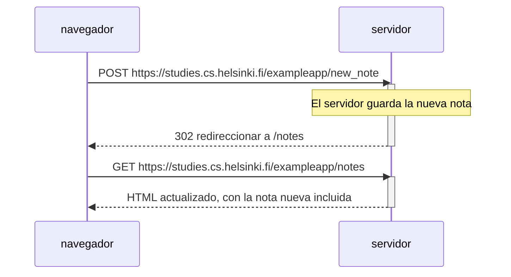

```mermaid
sequenceDiagram
    participant navegador
    participant servidor

    navegador->>servidor: POST https://studies.cs.helsinki.fi/exampleapp/new_note
    activate servidor
    Note over servidor: El servidor guarda la nueva nota
    servidor-->>navegador: 302 redireccionar a /notes
    deactivate servidor

    navegador->>servidor: GET https://studies.cs.helsinki.fi/exampleapp/notes
    activate servidor
    servidor-->>navegador: HTML actualizado, con la nota nueva incluida
    deactivate servidor
```
