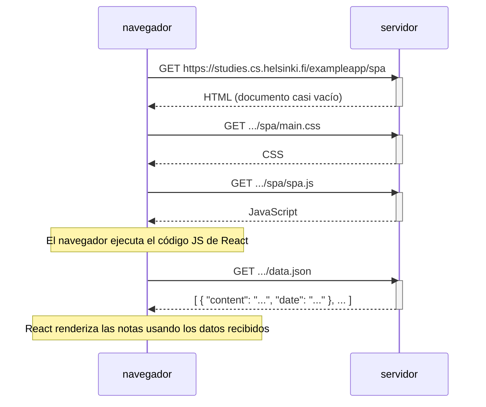

```mermaid
sequenceDiagram
    participant navegador
    participant servidor

    navegador->>servidor: GET https://studies.cs.helsinki.fi/exampleapp/spa
    activate servidor
    servidor-->>navegador: HTML (documento casi vacío)
    deactivate servidor

    navegador->>servidor: GET .../spa/main.css
    activate servidor
    servidor-->>navegador: CSS
    deactivate servidor

    navegador->>servidor: GET .../spa/spa.js
    activate servidor
    servidor-->>navegador: JavaScript
    deactivate servidor

    Note over navegador: El navegador ejecuta el código JS de React

    navegador->>servidor: GET .../data.json
    activate servidor
    servidor-->>navegador: [ { "content": "...", "date": "..." }, ... ]
    deactivate servidor

    Note over navegador: React renderiza las notas usando los datos recibidos
```
